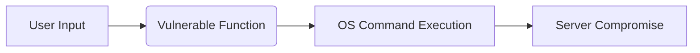
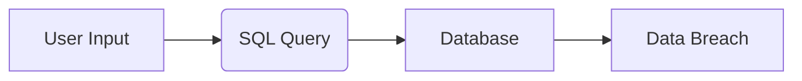
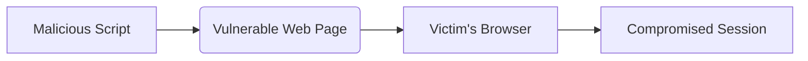
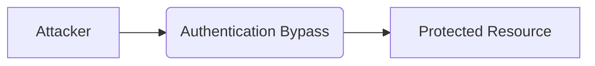
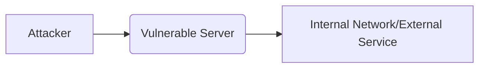
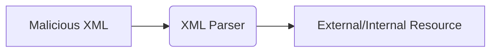

# High-Paying Bug Bounty Targets and Vulnerabilities Report

This report details several high-paying vulnerabilities commonly found in bug bounty programs.  Each section describes the vulnerability, how to find it, provides examples, and includes a Mermaid diagram illustrating the attack flow.

## 1. Remote Code Execution (RCE)

Remote Code Execution (RCE) is the most critical vulnerability, allowing attackers to execute arbitrary code on the target server. This often leads to complete server compromise and thus commands the highest payouts in bug bounty programs.

**How to find:** Focus on areas susceptible to injection vulnerabilities, such as:

* **Input Validation:** Look for insufficient input validation in web forms, API endpoints, and file uploads.
* **Deserialization:** Examine how the application handles serialized data.  Vulnerable deserialization can lead to RCE.
* **File Uploads:**  Test file upload functionalities for restrictions on file types and content.
* **Command Injection:** Analyze areas where user input is used to construct system commands.

**Example (Python - Command Injection):**

```python
import subprocess

user_input = input("Enter command: ")
subprocess.run(user_input, shell=True)  # Vulnerable! Never use shell=True with user input.
```

Using `shell=True` allows an attacker to inject arbitrary commands by manipulating the `user_input`.

**Mermaid Diagram (RCE Flow):**




## 2. SQL Injection (SQLi)

SQL Injection (SQLi) allows attackers to manipulate database queries, potentially extracting sensitive data or altering database content.  Despite being a well-known vulnerability, it remains prevalent and offers significant rewards in bug bounty programs.

**How to find:** Test any area where user input interacts with a database:

* **Web Forms:** Analyze input fields in forms that submit data to a database.
* **API Endpoints:** Test API endpoints that handle data queries.
* **Database Interactions:**  Examine any part of the application that directly interacts with a database.


**Example (Simplified SQLi):**

```sql
SELECT * FROM users WHERE username = '$user_input'; -- Vulnerable!
```

If `$user_input` isn't properly sanitized, an attacker can inject malicious SQL code.


**Mermaid Diagram (SQLi Flow):**




## 3. Cross-Site Scripting (XSS)

Cross-Site Scripting (XSS) involves injecting malicious scripts into web pages viewed by other users.  Successful XSS attacks can steal cookies, hijack sessions, redirect users to malicious sites, and deface websites.

**How to find:**  Look for areas where user-supplied data is displayed without proper sanitization:

* **Input Fields:** Test input fields, especially those that display the entered data on the page.
* **URLs:** Examine URL parameters for potential XSS vulnerabilities.
* **User-Generated Content:** Analyze sections displaying user-generated content, such as comments or forum posts.


**Example (Reflected XSS):**

```html
<p>You searched for: <%= search_term %></p>  <!-- Vulnerable if search_term isn't sanitized -->
```

If `search_term` is not sanitized, an attacker can inject JavaScript code.

**Mermaid Diagram (XSS Flow):**




## 4. Authentication Bypass

Authentication bypass vulnerabilities allow attackers to gain access to protected resources without valid credentials.  This can often lead to full account takeover.

**How to find:** Analyze authentication flows for logical flaws:

* **Logic Flaws:** Look for weaknesses in the authentication logic, such as incorrect password checks or session management errors.
* **Default Credentials:** Test for weak or default credentials.
* **Multi-Factor Authentication (MFA) Bypass:** Explore potential ways to bypass MFA mechanisms.

**Mermaid Diagram (Authentication Bypass):**




## 5. Server-Side Request Forgery (SSRF)

Server-Side Request Forgery (SSRF) exploits vulnerabilities to force a server to make HTTP requests to arbitrary internal or external resources. SSRF can be used to access internal services, scan internal networks, or make requests to external servers under the guise of the vulnerable server.

**How to find:** Identify functionalities that retrieve content from external URLs or internal resources:

* **URL Fetching:**  Examine functions that fetch content based on user-supplied URLs.
* **File Handling:** Check file handling functionalities that might allow access to internal files via URL schemes.


**Mermaid Diagram (SSRF Flow):**




## 6. XML External Entity (XXE) Injection

XXE injection exploits vulnerabilities in XML parsers to access local or remote resources. This can lead to sensitive data exfiltration, denial-of-service attacks, or server-side request forgery.

**How to find:** Test applications that parse XML data. Look for functionality that allows uploading or processing XML documents.

**Mermaid Diagram (XXE Flow):**




## 7. Business Logic Errors

Business Logic Errors are flaws in the application's logic that can be exploited for unintended actions. These vulnerabilities are often context-specific and can include privilege escalation, manipulating workflows, or bypassing payment gateways. Identifying business logic errors requires understanding the intended application behavior and looking for deviations.


## 8. Insecure Direct Object References (IDOR)

Insecure Direct Object References (IDOR) occur when applications directly use user-supplied input to access objects (e.g., user accounts, files) without proper authorization checks. This can allow unauthorized access to sensitive data.


## 9. Cross-Site Request Forgery (CSRF)

Cross-Site Request Forgery (CSRF) tricks a logged-in user into executing unwanted actions on a website in which they're currently authenticated.  CSRF attacks exploit the trust that a website has in a user's browser.


## 10. API Vulnerabilities

APIs are susceptible to many of the same vulnerabilities as web applications, but also have unique vulnerabilities related to authentication, authorization, rate limiting, and input validation. Testing APIs often requires specialized tools and techniques.


This report provides a starting point for understanding high-paying bug bounty vulnerabilities.  Always adhere to the rules and scope of each bug bounty program and practice ethical disclosure. Continuous learning and practice are essential for success in bug bounty hunting.