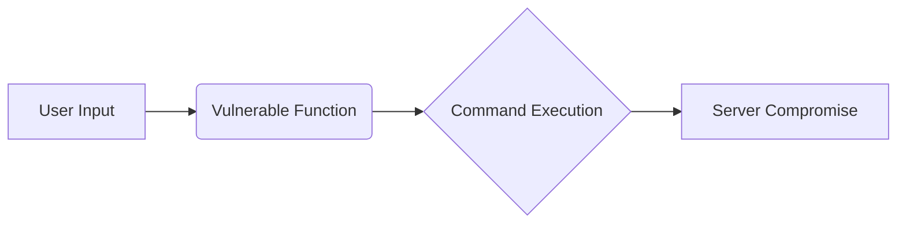

# High-Paying Bug Bounty Targets Report (2024 and Beyond)

This report details high-impact vulnerabilities frequently targeted in bug bounty programs, along with methods for discovery and example code snippets where applicable.  Remember, responsible disclosure is paramount. Always obtain explicit permission before testing on any system that you do not own.

## 1. Remote Code Execution (RCE)

**Description:** RCE allows attackers to execute arbitrary code on the target server, giving them significant control over the system.

**Finding RCE:** Examine user input handling for vulnerabilities, scrutinize deserialization processes, identify code injection points (SQLi, OS command injection), and investigate insecure file uploads.

**Example (OS Command Injection - Vulnerable):**

```python
import subprocess
user_input = input("Enter filename: ")
subprocess.run(f"cat {user_input}", shell=True) # VULNERABLE!
```

**Mermaid Diagram (RCE Flow):**



## 2. SQL Injection (SQLi)

**Description:** SQLi enables attackers to manipulate database queries, potentially leading to data breaches, data manipulation, or system compromise.

**Finding SQLi:** Test web application inputs with SQL syntax. Observe error messages or unexpected application behavior that might indicate SQLi vulnerabilities.

**Example (SQLi - Vulnerable):**

```php
$username = $_GET['username'];
$query = "SELECT * FROM users WHERE username = '$username'"; // VULNERABLE!
$result = mysqli_query($conn, $query);
```


## 3. Cross-Site Scripting (XSS)

**Description:** XSS allows attackers to inject malicious scripts into web pages viewed by other users. These scripts can steal cookies, redirect users to malicious sites, or deface web pages.

**Finding XSS:** Inject JavaScript payloads into input fields, URLs, and other areas where user-supplied data is displayed. Observe if the payload executes in the victim's browser.

**Example (XSS - Vulnerable):**

```javascript
document.write("Hello, " + document.location.hash.substring(1)); // VULNERABLE!
```


## 4. Authentication Bypass

**Description:** Authentication bypass vulnerabilities allow unauthorized users to gain access to systems or data without proper credentials.

**Finding Authentication Bypass:** Analyze authentication logic for weaknesses. Look for logic flaws, broken access controls, and session management issues.  Attempt to bypass login mechanisms or access protected resources without valid credentials.


## 5. Authorization Bypass (Privilege Escalation)

**Description:** Authorization bypass involves gaining higher-level privileges than intended, allowing attackers to access restricted functionalities or data.

**Finding Authorization Bypass:** Rigorously test access controls. Try accessing resources or performing actions that should be restricted to certain user roles.  Look for ways to escalate privileges within the application.


## 6. Server-Side Request Forgery (SSRF)

**Description:** SSRF tricks a server into making requests to internal or external resources that it shouldn't access, potentially revealing sensitive information or allowing internal network attacks.

**Finding SSRF:** Look for functionalities that fetch resources based on user input, such as URL fetching, image processing, or web page previews.  Attempt to make the server connect to internal services or restricted resources.


## 7. XML External Entity (XXE) Injection

**Description:** XXE injection exploits XML parsers to access external entities, potentially leading to data exfiltration, denial of service, or server-side request forgery.

**Finding XXE:** Test applications that process XML data. Look for vulnerabilities in XML parsers by attempting to include external entities in XML documents.


## 8. Business Logic Errors

**Description:** Business logic errors are flaws in the application's core logic that can be exploited to manipulate data, bypass intended workflows, or gain unauthorized access.

**Finding Business Logic Errors:** Carefully analyze the application's workflow, state transitions, and data handling processes. Identify inconsistencies, unexpected behavior, or exploitable logic.  


## 9. API Vulnerabilities

**Description:** API vulnerabilities are security weaknesses in Application Programming Interfaces.  These can include broken authentication, authorization flaws, excessive data exposure, or input validation issues.

**Finding API Vulnerabilities:** Analyze API documentation and test API endpoints for common vulnerabilities. Use tools like Postman or Burp Suite to intercept and modify API requests.


## 10. Zero-Day Vulnerabilities

**Description:** Zero-day vulnerabilities are undisclosed security flaws unknown to the vendor. These are highly valuable in bug bounty programs due to their critical nature.

**Finding Zero-Days:** Requires advanced skills including extensive research, reverse engineering, fuzzing, and code analysis.


## General Bug Bounty Hunting Tips

* **Recon:** Conduct thorough research on the target scope, including subdomains, technologies used, and potential attack surfaces.
* **Vulnerability Scanning:** Use automated vulnerability scanners to identify common weaknesses.
* **Manual Testing:** Essential for uncovering complex logic flaws and vulnerabilities that automated tools might miss.
* **Stay Updated:** Keep learning about new vulnerabilities, exploitation techniques, and security best practices.


**Disclaimer:** This report is for informational purposes only.  Always practice ethical hacking and adhere to responsible disclosure guidelines.  Specific bug bounty payouts vary depending on vulnerability severity and program rules.